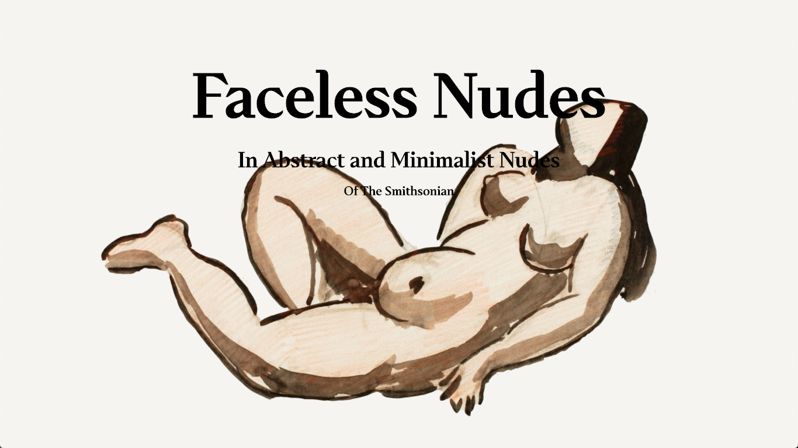
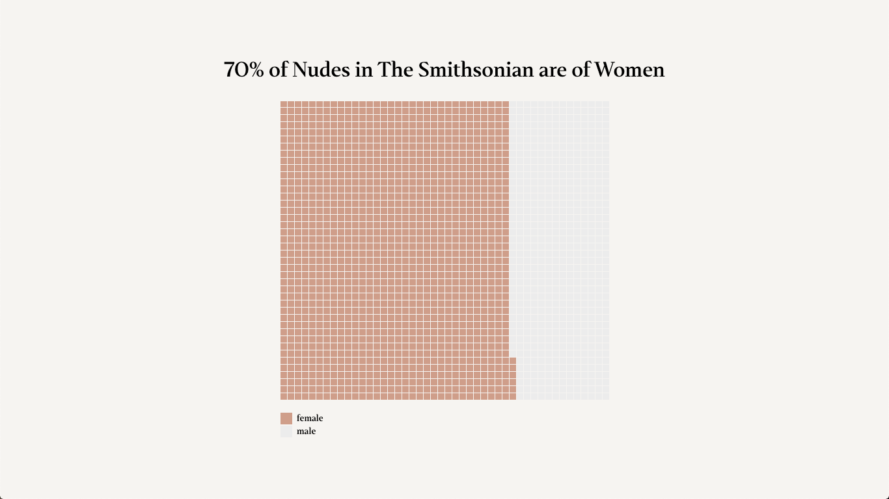
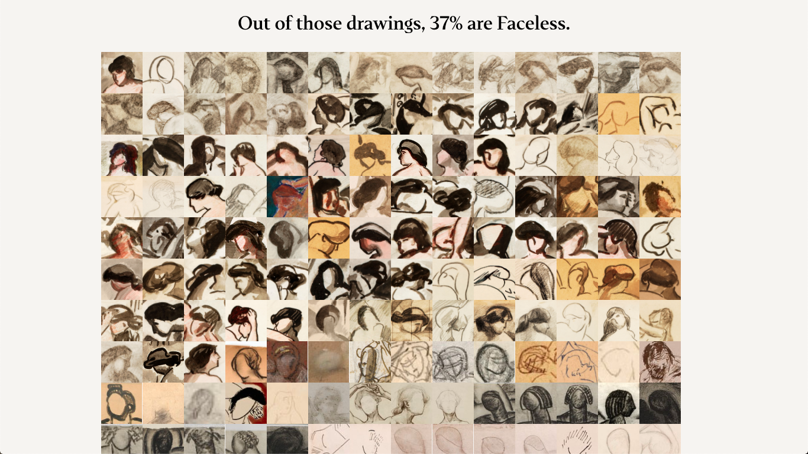
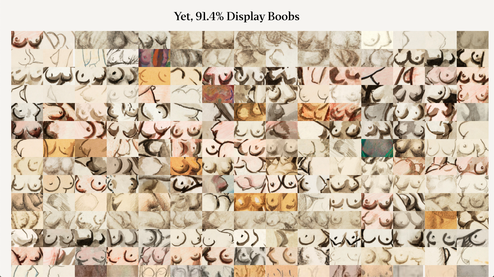
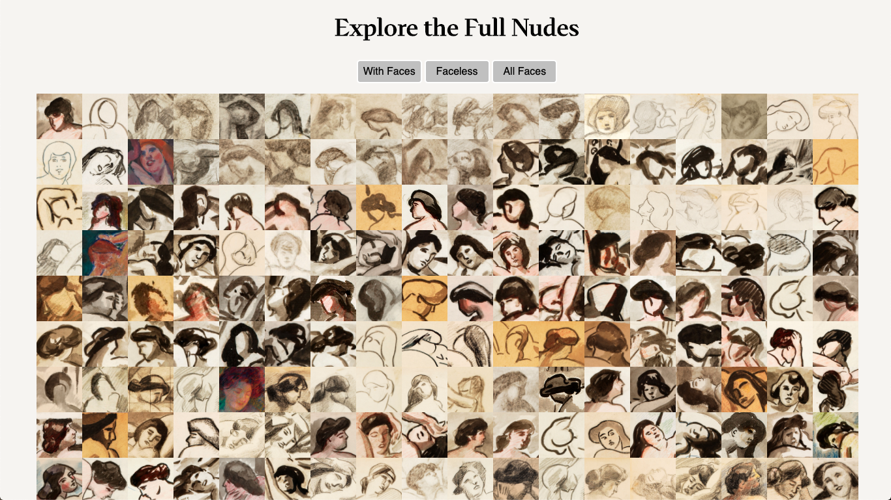

# Faceless Nudes

[Final Project](https://isabelstoddart.github.io/FacelessNudes/)

This was a two part project that started off as Carl Newman's Faceless Nudes, documented [HERE](https://github.com/isabelstoddart/MS1Qualitative/blob/main/README.md)

I discovered while searching the Smithsonian API that many of Carl Newman's nude drawings are faceless. I decided to expand this project after getting comments on this discovery to see if this pattern holds true with other artists nudes. 

This project is an observation piece uncovering the many drawings of faceless nudes in the Smithsonian. It touches on the objectification at hand by comparing faceless nudes to highly detailed breasts. I hope this project makes people think about this topic and maybe discover even more faceless nudes outside of the Smithsonian. 

## Iteration 1

This project started out as a rough idea to further explore the concept of faceless nudes. A rough prototype is included below.

https://www.figma.com/file/qV4XCPlTsdQ4V8MPEcXyEs/MS1StoryRoughProto?node-id=0%3A1

## Iteration 2

My second iteration narrowed my search to only drawings of nudes, included a sample to show the now apparent theme of faceless nudes in all drawings of nudes, and included graphs and quotes to create a full story. A prototype is included below.

https://www.figma.com/file/OoljzKK7CmGXeniVnt1eTF/FacelessNudesProto2?node-id=0%3A1

## Final Iteration

My final iteration brought everything from the second iteration together with a scrollytelling effect. 

The final project can be found here: https://isabelstoddart.github.io/FacelessNudes/

** Scrollytelling code inspired by: https://towardsdatascience.com/how-i-created-an-interactive-scrolling-visualisation-with-d3-js-and-how-you-can-too-e116372e2c73 
**

** Waffle chart code inspired by: http://bl.ocks.org/XavierGimenez/8070956 **
